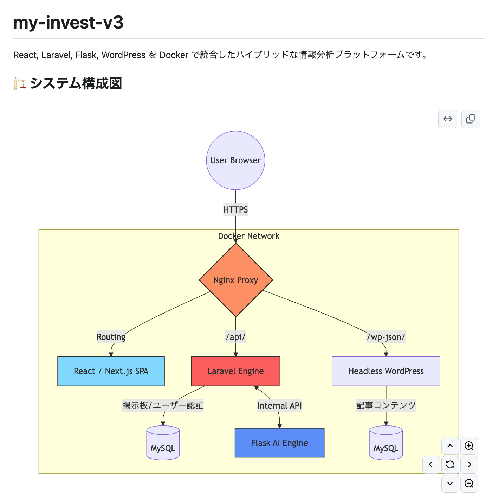
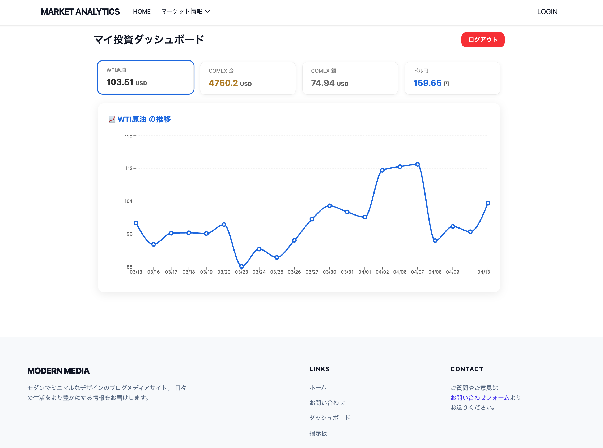

# Hi, I'm Makoto Kurokawa | IT Executive & Strategic PM

Business-driven IT leader with over 30 years of experience in leading mission-critical projects at global giants including **IBM, DEC, and Japan Telecom**. 

Expert in **"Strategic Bridge Management"**—aligning high-level global architectures (US/Europe) with the rigorous quality and operational standards of the Japanese market.

### 🌟 Key Expertise
- **Strategic Bridge Management**: Translating global designs into executable local strategies (e.g., Daimler/Mitsubishi Fuso integration).
- **IT Governance & Audit**: Certified **Systems Auditor** with deep knowledge of EA, BPR, and Risk Management.
- **Multinational Leadership**: Proven track record of managing teams across US, Germany, India, and Japan (e.g., TCSI Submarine Cable Project).

#### 1. System Component Diagram
![System Architecture]

*This diagram illustrates the containerized environment using Docker, orchestrating React (Vite) for the frontend and Laravel for the API gateway.*

#### 2. Process Sequence Diagram
![Sequence Diagram]

*Visualizing the data flow and integration logic between the user interface, backend services, and automated testing modules.*

#### **Technical Highlights of this Architecture:**
- **Automated CI/CD**: Leveraging **GitHub Actions** and **Docker Hub** for seamless deployment from code push to VPS.
- **Containerization**: Full-stack isolation using **Docker** and **Docker Compose**.
- **Security & Reliability**: Optimized with **Nginx** reverse proxy and automated **SSL (Certbot)** management.
- **Audit-Ready Design**: Structured with a focus on "Separation of Concerns" for enhanced security and maintainability.

### 🛠 Modern Tech Stack (Active Practition)
Even during my 10 years as a CEO, I have remained hands-on to ensure strategic decisions are grounded in technical reality.
- **Languages**: Python (Certified), PHP (Laravel), JavaScript (React, Next.js).
- **Infra/DevOps**: Docker, GitHub Actions, Nginx, VPS Management.
- **AI-Driven Development**: Leveraging LLMs (Gemini/ChatGPT) as "Senior Pair Programmers" to accelerate development while maintaining audit-level code quality.

### 🔗 Portfolio & Links
- **Demo Site**: [mkc15.net](https://mkc15.net)
- **LinkedIn/Contact**: 

### 📜 Certifications
- **Certified Systems Auditor** (Advanced Information Technology Engineer, Japan)
- **Network Specialist** (Formerly "Online Systems Engineer")
- **Python 3 Certified Engineer** (Obtained 2025)
- **TOEIC 860** (Business Professional English)

---
"I don't just manage projects; I understand the code, the infrastructure, and the business risk—all at the same time."
